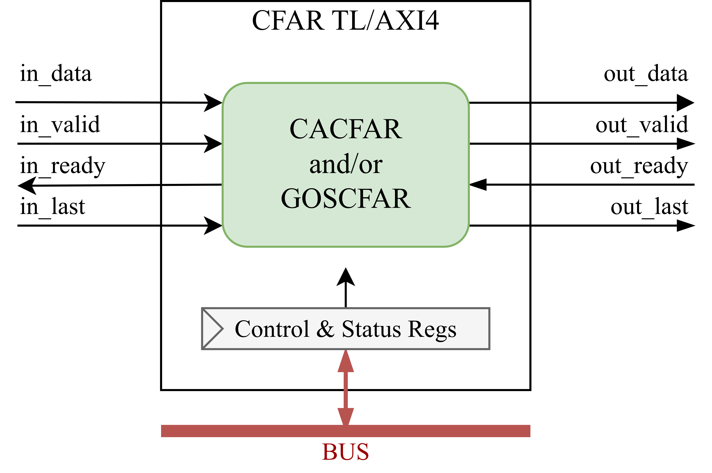

CFAR Overview
=============

The ``CFAR`` module is part of the OPERA-DSP project. This module implements 1D Constant False Alarm Rate target detection for range spectra. For each Cell Under Test (CUT), the block estimates local noise from neighbouring reference cells, scales that estimate into an adaptive threshold, and reports a peak when the CUT exceeds the threshold.

The memory-mapped ``CFARAXI4`` and ``CFARTL`` variants expose the same CFAR core through AXI4-Stream sample input/output and AXI4 or TileLink control/status registers.

The memory-mapped variants extend the `DspBlock <https://chipyard.readthedocs.io/en/latest/Customization/Dsptools-Blocks.html>`_ trait for modular signal processing integration.

Key features of the CFAR block include:

- Cell-Averaging CFAR modes: CA-CFAR, GOCA, and SOCA
- Generalized Ordered-Statistic CFAR modes: GOS-CA, GOS-GO, and GOS-SO with per-side rank selection
- Runtime FFT size, threshold scale, CFAR mode, reference window, guard window, and peak grouping control
- Optional runtime log-domain thresholding through ``i_log_mode`` or the ``log_mode`` register
- Edge policies for suppressing edge bins, using the available one-sided window, or wrapping reference windows around the frame
- Frame-safe runtime updates through ``i_load_cfg`` or the ``load_cfg`` register
- Optional output CUT payload, output retiming, arithmetic pipe stages, and SRAM-backed delay storage
- Runtime control through AXI4 or TileLink memory-mapped registers

For more information about these blocks see: :doc:`Cell-Averaging CFAR <../Modules/CACFAR>`, :doc:`GOS-CFAR <../Modules/GOSCFAR>`, and :doc:`Linear Insertion Sorter <../Modules/LinearInsertionSorter>`.

Simplified Block Diagram
------------------------

Below is a simplified block diagram of the CFAR module.

Non-wrap edge policies use streaming cores that process samples as they arrive. ``WrapAroundFrame`` uses a cyclic path that buffers each frame, replays the frame with wrapped halo samples, and then computes a complete two-sided reference window for every CUT. When ``runtimeEdgePolicy`` is enabled, both paths are instantiated and each frame is routed according to the loaded edge policy.

CFAR Parameters
---------------

The CFAR blocks are configured using the ``CFARParams`` case class. The direct core supports ``FixedPoint``, ``UInt``, and ``SInt`` sample, threshold, and scale types. The JSON generator path currently creates ``FixedPoint`` configurations.

.. code-block:: scala

  case class CFARParams[T <: Data: Real](
    inputType        : T,
    thresholdType    : T,
    scaleType        : T,
    cfarType         : Int = CFARType.CellAveraging,
    lisType          : String = LISType.CntBased,
    maxReferenceCells: Int = 16,
    maxGuardCells    : Int = 4,
    maxFftSize       : Int = 1024,
    sendCut          : Boolean = true,
    logMode          : Boolean = false,
    runtimeLogMode   : Boolean = false,
    edgePolicy       : Int = CFAREdgePolicy.OneSidedAverage,
    runtimeEdgePolicy: Boolean = false,
    retiming         : Boolean = false,
    addPipeStages    : Int = 0,
    mulPipeStages    : Int = 0,
    minSRAMDepth     : Int = 8
  )

**Parameter descriptions:**

- ``inputType``:
  Input sample type used by the input data stream.

- ``thresholdType``:
  Threshold data type.

- ``scaleType``:
  Runtime threshold-scale type.

- ``cfarType``:
  Selects the generated CFAR family. ``CFARType.CellAveraging`` generates ``CACFAR`` and ``CFARType.OrderedStatistic`` generates ``GOSCFAR``.

- ``lisType``:
  Selects the ordered-statistic sorter implementation. Valid values are ``LISType.CntBased`` and ``LISType.RegBased``.

- ``maxReferenceCells``:
  Maximum number of reference cells on each side of the CUT.

- ``maxGuardCells``:
  Maximum number of guard cells on each side of the CUT.

- ``maxFftSize``:
  Maximum supported frame size.

- ``sendCut``:
  If ``true``, includes the delayed CUT value in the output payload and memory-mapped stream word.

- ``logMode``:
  Static threshold-scaling mode. If ``true``, the threshold is ``noise + threshold_scale``. If ``false``, the threshold is ``noise * threshold_scale``.

- ``runtimeLogMode``:
  If ``true``, exposes ``i_log_mode`` and the ``log_mode`` register.

- ``edgePolicy``:
  Static edge handling policy used when ``runtimeEdgePolicy`` is disabled.

- ``runtimeEdgePolicy``:
  If ``true``, exposes ``i_edge_policy`` and the ``edge_policy`` register.

- ``retiming``:
  Adds an output retiming stage.

- ``addPipeStages``:
  Number of configured add/subtract pipeline stages used by threshold arithmetic.

- ``mulPipeStages``:
  Number of configured multiplication pipeline stages used by threshold arithmetic.

- ``minSRAMDepth``:
  Delay depths at or above this value use SRAM-backed delay cells.

**Requirements:**

- ``inputType``, ``thresholdType``, and ``scaleType`` must be ``FixedPoint``, ``UInt``, or ``SInt`` Chisel types.
- ``maxReferenceCells`` and ``maxFftSize`` must be powers of two.
- ``maxReferenceCells`` and ``maxGuardCells`` must be positive.
- Cell-Averaging CFAR requires ``maxReferenceCells > maxGuardCells``.
- ``cfarType`` must be ``CFARType.CellAveraging`` or ``CFARType.OrderedStatistic``.
- Ordered-statistic CFAR requires ``lisType`` to be ``LISType.CntBased`` or ``LISType.RegBased``.
- ``edgePolicy`` must be ``CFAREdgePolicy.SuppressEdges``, ``CFAREdgePolicy.OneSidedAverage``, or ``CFAREdgePolicy.WrapAroundFrame``.
- ``addPipeStages``, ``mulPipeStages``, and ``minSRAMDepth`` must be non-negative.
- Runtime ``i_fft_size`` must be greater than ``2 * reference_cells + 2 * guard_cells + 1`` and no larger than ``maxFftSize``.

**Selector values:**

- ``CFARType.CellAveraging`` (``0``): ``CACFAR``
- ``CFARType.OrderedStatistic`` (``1``): ``GOSCFAR``
- ``CFARMode.CellAveraging`` (``0``): CA-CFAR or GOS-CA
- ``CFARMode.GreatestOf`` (``1``): GOCA or GOS-GO
- ``CFARMode.SmallestOf`` (``2``): SOCA or GOS-SO
- ``CFAREdgePolicy.SuppressEdges`` (``0``): suppress edge-bin detections and report a zero threshold
- ``CFAREdgePolicy.OneSidedAverage`` (``1``): use the available side near frame edges
- ``CFAREdgePolicy.WrapAroundFrame`` (``2``): wrap reference windows circularly inside the frame

The memory-mapped wrappers use the same CFAR core parameters and add an address region and register beat width:

.. code-block:: scala

  class CFARAXI4[T <: Data: Real: BinaryRepresentation](
    address  : AddressSet,
    params   : CFARParams[T],
    beatBytes: Int = 4
  )(implicit p: Parameters)

  class CFARTL[T <: Data: Real: BinaryRepresentation](
    address  : AddressSet,
    params   : CFARParams[T],
    beatBytes: Int = 4
  )(implicit p: Parameters)

- ``address``:
  Memory-mapped register region.

- ``params``:
  CFAR core parameters.

- ``beatBytes``:
  Memory-mapped register beat width.

Register Map
------------

The following registers are exposed through the MMIO interface of the ``CFARAXI4`` and ``CFARTL`` wrappers. The offsets are defined by ``CFARRegs``. Each register is placed at ``index * beatBytes`` and every generated register field must fit within ``beatBytes * 8`` bits.

.. list-table::
   :header-rows: 1
   :widths: 18 12 10 22 38

   * - Register
     - Offset
     - Access
     - Availability
     - Description
   * - ``fft_size``
     - ``0*beatBytes``
     - R/W
     - Always
     - Active frame size in samples
   * - ``threshold_scale``
     - ``1*beatBytes``
     - R/W
     - Always
     - Raw threshold scale interpreted as ``scaleType``
   * - ``peak_grouping``
     - ``2*beatBytes``
     - R/W
     - Always
     - Require local-maximum detection before reporting a peak
   * - ``cfar_mode``
     - ``3*beatBytes``
     - R/W
     - Always
     - 0 = CA/GOS-CA, 1 = GOCA/GOS-GO, 2 = SOCA/GOS-SO
   * - ``reference_cells``
     - ``4*beatBytes``
     - R/W
     - Always
     - Active reference cells per side
   * - ``guard_cells``
     - ``5*beatBytes``
     - R/W
     - Always
     - Active guard cells per side
   * - ``noise_div_shift``
     - ``6*beatBytes``
     - R/W
     - Cell-Averaging
     - Right shift applied to each side reference sum
   * - ``order_rank_left``
     - ``7*beatBytes``
     - R/W
     - OrderedStatistic
     - One-based ascending rank selected from the left reference side
   * - ``order_rank_right``
     - ``8*beatBytes``
     - R/W
     - OrderedStatistic
     - One-based ascending rank selected from the right reference side
   * - ``log_mode``
     - ``9*beatBytes``
     - R/W
     - ``runtimeLogMode``
     - 1 selects log-domain thresholding, 0 selects linear thresholding
   * - ``edge_policy``
     - ``10*beatBytes``
     - R/W
     - ``runtimeEdgePolicy``
     - Runtime edge policy: 0 = suppress, 1 = one-sided, 2 = wrap
   * - ``load_cfg``
     - ``11*beatBytes``
     - W
     - Always
     - Write 1 to pulse runtime configuration load

Software writes the desired configuration registers and then writes ``1`` to ``load_cfg``. The wrapper pulses the core ``i_load_cfg`` input, and the core applies the pending configuration at a frame-safe boundary.

Family-specific and optional registers are omitted when they do not apply:

- ``noise_div_shift`` is generated only for ``CFARType.CellAveraging``.
- ``order_rank_left`` and ``order_rank_right`` are generated only for ``CFARType.OrderedStatistic``.
- ``log_mode`` is generated only when ``runtimeLogMode`` is true.
- ``edge_policy`` is generated only when ``runtimeEdgePolicy`` is true.

IOs
---

The direct ``CFAR`` core uses ``CFARIO``:

.. code-block:: scala

  class CFARIO[T <: Data: Real](val params: CFARParams[T]) extends Bundle {
    val i_data             = Flipped(Decoupled(params.inputType))
    val i_last             = Input(Bool())
    val i_load_cfg         = Input(Bool())
    val i_fft_size         = Input(UInt(log2Ceil(params.maxFftSize + 1).W))
    val i_threshold_scale  = Input(params.scaleType)
    val i_log_mode         = if (params.runtimeLogMode) Some(Input(Bool())) else None
    val i_peak_grouping    = Input(Bool())
    val i_cfar_mode        = Input(UInt(2.W))
    val i_edge_policy      = if (params.runtimeEdgePolicy) Some(Input(UInt(2.W))) else None
    val i_reference_cells  = Input(UInt(log2Ceil(params.maxReferenceCells + 1).W))
    val i_guard_cells      = Input(UInt(log2Ceil(params.maxGuardCells + 1).W))
    val i_noise_div_shift  = if (params.cfarType == CFARType.OrderedStatistic) None else Some(Input(UInt(log2Ceil(log2Ceil(params.maxReferenceCells + 1)).W)))
    val i_order_rank_left  = if (params.cfarType == CFARType.OrderedStatistic) Some(Input(UInt(log2Ceil(params.maxReferenceCells + 1).W))) else None
    val i_order_rank_right = if (params.cfarType == CFARType.OrderedStatistic) Some(Input(UInt(log2Ceil(params.maxReferenceCells + 1).W))) else None
    val o_data             = Decoupled(new CFAROutput(params.inputType, params.thresholdType, params.sendCut))
    val o_last             = Output(Bool())
    val o_fft_bin          = Output(UInt(log2Ceil(params.maxFftSize).W))
  }

``i_data`` and ``o_data`` use ready/valid handshakes. ``i_last`` must mark the final input sample of the active frame, and ``o_last`` marks the final output result for that frame.

``CFAROutput`` contains ``peak`` and ``threshold``. When ``sendCut`` is true, it also contains the delayed ``cut`` sample. ``o_fft_bin`` reports the original-frame bin index aligned with the output result.

The memory-mapped wrappers include I/Os provided by the `DspBlock <https://chipyard.readthedocs.io/en/latest/Customization/Dsptools-Blocks.html>`_ trait:

- AXI4-Stream input for scalar CFAR samples
- AXI4-Stream output for packed CFAR results
- AXI4 or TileLink memory-mapped I/O for runtime configuration

``CFARDspBlock`` instantiates ``CFAR``, maps control registers to the direct core configuration ports, and packs output fields into the AXI4-Stream result word. Input AXI4-Stream ``data`` carries one sample in the low ``inputType`` bits. Input ``last`` must mark the final sample of the active frame.

Output AXI4-Stream ``data`` carries the packed result, zero-padded to the output beat width:

.. code-block:: text

   [ threshold | cut if sendCut | fft_bin | peak ]

``peak`` is the least-significant bit. Output ``last`` is aligned with the final CFAR result for the frame.

.. _memory-mapped-cfar:

SystemVerilog Generation
------------------------

You can generate SystemVerilog from the CFAR block using either AXI4 or TL as the memory-mapped control interface.

Use the following commands in the project root folder:

.. code-block:: bash

   # AXI4 Version
   sbt "project cfar; runMain opera.cfar.AXI4App"
   # TileLink Version
   sbt "project cfar; runMain opera.cfar.TLApp"

This generates SystemVerilog code in the ``./rtl/CFARAXI4`` folder for the AXI4 variant or ``./rtl/CFARTL`` for the TileLink variant.

Additionally, you can pass the path to a JSON file containing CFAR parameters, for example:

.. code-block:: bash

   # AXI4 Version
   sbt "project cfar; runMain opera.cfar.AXI4App cfar/src/main/resources/parameters.json"
   # TileLink Version
   sbt "project cfar; runMain opera.cfar.TLApp cfar/src/main/resources/parameters.json"

The JSON file contains one memory-mapped address region and one ``parameters`` object:

.. code-block:: json

  {
    "address": {
      "base": "0x00002000",
      "mask": "0x000000FF"
    },
    "parameters": {
      "beatBytes"          : 4,
      "inputWidth"         : 16,
      "inputBinPoint"      : 14,
      "thresholdWidth"     : 16,
      "thresholdBinPoint"  : 14,
      "scaleWidth"         : 16,
      "scaleBinPoint"      : 14,
      "cfarType"           : "CellAveraging",
      "lisType"            : "CntBased",
      "maxReferenceCells"  : 16,
      "maxGuardCells"      : 4,
      "maxFftSize"         : 1024,
      "sendCut"            : true,
      "logMode"            : false,
      "runtimeLogMode"     : false,
      "edgePolicy"         : "OneSidedAverage",
      "runtimeEdgePolicy"  : false,
      "retiming"           : false,
      "addPipeStages"      : 0,
      "mulPipeStages"      : 0,
      "minSRAMDepth"       : 8
    }
  }

- ``address.base`` and ``address.mask`` define the AXI4 or TileLink register region.
- ``beatBytes`` defines the memory-mapped register beat width.
- ``inputWidth``/``inputBinPoint``, ``thresholdWidth``/``thresholdBinPoint``, and ``scaleWidth``/``scaleBinPoint`` define the FixedPoint stream and control formats.
- ``cfarType`` accepts ``CellAveraging`` or ``OrderedStatistic``.
- ``lisType`` accepts ``CntBased`` or ``RegBased``.
- ``edgePolicy`` accepts ``SuppressEdges``, ``OneSidedAverage``, or ``WrapAroundFrame``.

Unknown selector strings fail configuration parsing instead of selecting a fallback value.

You can find the example JSON configuration file `on GitHub <https://github.com/opera-platform/opera-dsp/blob/main/cfar/src/main/resources/parameters.json>`_.

Tests
-----

To run tests, use the following commands in the project root folder:

.. code-block:: bash

   # Direct Core
   sbt "project cfar; testOnly opera.cfar.CFARSpec"
   # AXI4 Version
   sbt "project cfar; testOnly opera.cfar.MemoryMappedAXI4CFARSpec"
   # TileLink Version
   sbt "project cfar; testOnly opera.cfar.MemoryMappedTLCFARSpec"

Verbose logging, randomized ready/valid traffic, and plot generation are passed after ``--``:

.. code-block:: bash

   sbt "project cfar; testOnly opera.cfar.CFARSpec -- -Dcfar.randomReadyValid=true"
   sbt "project cfar; testOnly opera.cfar.MemoryMappedAXI4CFARSpec -- -Dcfar.verbose=true"
   sbt "project cfar; testOnly opera.cfar.MemoryMappedTLCFARSpec -- -Dcfar.plot=true"

The memory-mapped specs program CSRs over AXI4 or TileLink, drive AXI4-Stream frames, decode packed output payloads, and compare against ``CFARModel``.

Output directory is ``./cfar/test_run_dir/``.

Source Code
-----------

You can view the source code here:

`cfar/src on GitHub <https://github.com/opera-platform/opera-dsp/tree/main/cfar/src>`_
