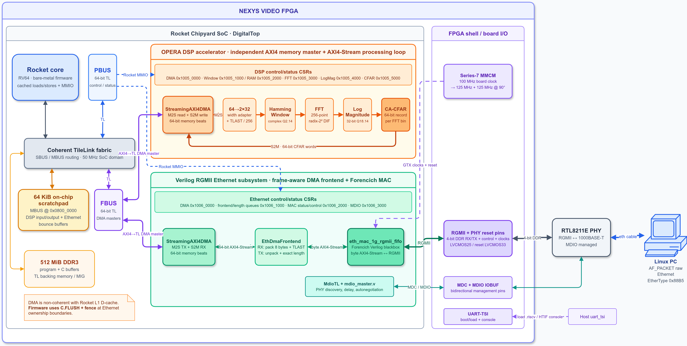
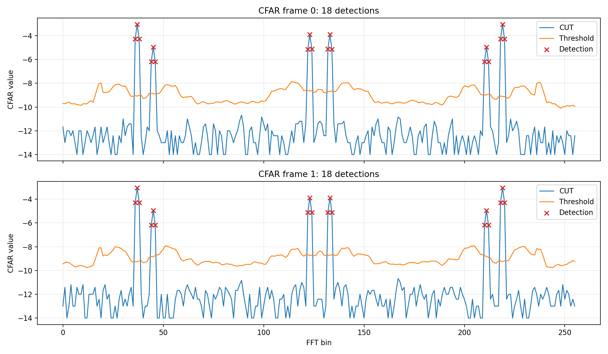

OPERA-DSP Chipyard Integration
==============================

The OPERA-DSP chain is integrated into Chipyard as a memory-mapped accelerator next to a
Verilog RGMII Ethernet subsystem.  The ``OperaDspNexysVideoConfig`` configuration combines
one Rocket core, the OPERA-DSP chain, Ethernet, MDIO PHY management, DDR3, a 64 KiB memory-bus
scratchpad, and UART-TSI. The design is implemented on a Nexys Video FPGA board.

Rocket accesses the DSP and Ethernet control and status registers through the TileLink
peripheral bus (PBUS).  Each subsystem has an independent ``StreamingAXI4DMA`` memory master.
The DMA masters are converted from AXI4 to TileLink and connected to the front bus (FBUS), from
which they can reach the scratchpad or DDR memory.

The OPERA-DSP streaming path is:

.. code-block:: text

   DSP DMA read
     -> 64-to-32-bit sample adapter and frame-last insertion
     -> Hamming window
     -> 256-point radix-2^2 DIF FFT
     -> log magnitude
     -> CA-CFAR
     -> DSP DMA write

The Ethernet subsystem places ``EthDmaFrontend`` between its 64-bit DMA stream and the byte-wide Forencich ``eth_mac_1g_rgmii_fifo`` Verilog MAC. 
The frontend packs received MAC bytes into 64-bit DMA beats and unpacks transmit beats using a queued exact frame length.
The MDIO block is separate from the data path and is used to discover and configure the Nexys Video RTL8211E PHY.

Ethernet is not connected directly to the DSP chain as a hardware stream. 
Rocket firmware receives Ethernet data into memory, validates the transfer, copies the samples into the DSP input
buffer, starts the DSP DMA, and sends the resulting CFAR records back through Ethernet.

The external DMA masters are not coherent with the Rocket L1 data cache.
Configurations that use Ethernet therefore enable ``C.FLUSH``, and the firmware uses cache flushes and memory fences when ownership of a shared buffer changes between Rocket and a DMA engine.

Simplified Block Diagram
------------------------

The following diagram shows the Rocket SoC, the OPERA-DSP chain, the Ethernet subsystem, their memory-mapped control paths, and their independent DMA paths.

The editable diagram is available as :download:`opera-soc.drawio <./images/opera-soc.drawio>`.

Address Map
-----------

The combined configuration uses a 64 KiB scratchpad beginning at ``0x08000000``.  DSP buffers and
Ethernet bounce buffers occupy disjoint parts of this scratchpad.

.. list-table:: Scratchpad layout
   :header-rows: 1
   :widths: 28 72

   * - Address range
     - Function
   * - ``0x08000000``--``0x08003fff``
     - DSP input samples.
   * - ``0x08004000``--``0x0800bfff``
     - DSP output containing one packed 64-bit CFAR record per FFT bin.
   * - ``0x0800c000``--``0x0800cfff``
     - Ethernet transmit bounce buffer.
   * - ``0x0800d000``--``0x0800dfff``
     - Ethernet receive bounce buffer.
   * - ``0x0800e000``--``0x0800ffff``
     - Unallocated scratchpad remainder.

The DSP and Ethernet peripherals use separate MMIO regions on PBUS:

.. list-table:: Peripheral address map
   :header-rows: 1
   :widths: 28 30 42

   * - Address range
     - Block
     - Function
   * - ``0x10050000``--``0x10050fff``
     - OPERA-DSP DMA
     - Memory-to-stream and stream-to-memory descriptors, status, and control.
   * - ``0x10051000``--``0x10051fff``
     - Windowing
     - Windowing control and status registers.
   * - ``0x10052000``--``0x10052fff``
     - Window coefficient RAM
     - Optional coefficient-memory address reserved by the chain parameters.
   * - ``0x10053000``--``0x10053fff``
     - FFT
     - FFT size, scaling, direction, configuration load, and status.
   * - ``0x10054000``--``0x10054fff``
     - Log magnitude
     - Magnitude implementation selection and control.
   * - ``0x10055000``--``0x10055fff``
     - CFAR
     - CFAR size, reference/guard cells, threshold, mode, and edge-policy control.
   * - ``0x10060000``--``0x10060fff``
     - Ethernet DMA
     - Ethernet transmit and receive DMA descriptors, status, and control.
   * - ``0x10061000``--``0x10061fff``
     - Ethernet frontend
     - Receive-length and transmit-length queues plus frontend diagnostics.
   * - ``0x10062000``--``0x10062fff``
     - Ethernet MAC
     - MAC enable, inter-frame gap, speed, and sticky event status.
   * - ``0x10063000``--``0x100630ff``
     - MDIO
     - MDIO transactions used to manage the Ethernet PHY.

The current chain stores constant Hamming coefficients in a ROM, so the optional window coefficient RAM at ``0x10052000`` is reserved but is not decoded. 
The active DSP and Ethernet MMIO regions are disjoint, and the scratchpad allocation prevents DSP input/output data from overlapping the Ethernet bounce buffers.

Short explanation for Source-Code
---------------------------------

.. list-table:: OPERA-DSP and Ethernet integration sources
   :header-rows: 1
   :widths: 16 42 42

   * - Area
     - Source
     - Role
   * - Build
     - `build.sbt <https://github.com/opera-platform/opera-soc/blob/main/build.sbt>`_
     - Declares the Ethernet and OPERA-DSP projects and their Chipyard dependencies.
   * - SoC top level
     - `DigitalTop.scala <https://github.com/opera-platform/opera-soc/blob/main/generators/chipyard/src/main/scala/DigitalTop.scala>`_
     - Mixes the optional DSP chain, RGMII Ethernet, and MDIO peripherals into ``DigitalTop``.
   * - Base configuration
     - `AbstractConfig.scala <https://github.com/opera-platform/opera-soc/blob/main/generators/chipyard/src/main/scala/config/AbstractConfig.scala>`_
     - Adds the RGMII and MDIO I/O binders and the 64 KiB scratchpad.
   * - DSP chain
     - `OperaDspChain.scala <https://github.com/opera-platform/opera-soc/blob/main/generators/chipyard/src/main/scala/example/opera-dsp/OperaDspChain.scala>`_
     - Contains the DSP chain, assigns addresses, and attaches DSP MMIO to PBUS and the DMA master to FBUS.
   * - DSP configurations
     - `OperaDspConfigs.scala <https://github.com/opera-platform/opera-soc/blob/main/generators/chipyard/src/main/scala/config/OperaDspConfigs.scala>`_
     - Defines the standalone DSP and combined Ethernet-loopback DSP configurations.
   * - Ethernet generator
     - `generators/ethernet/src/main/scala <https://github.com/opera-platform/opera-soc/tree/main/generators/ethernet/src/main/scala>`_
     - Contains the Ethernet DMA, frame frontend, MAC wrapper, MDIO, configuration fragments, and RGMII periphery.
   * - Ethernet configuration
     - `EthernetConfigs.scala <https://github.com/opera-platform/opera-soc/blob/main/generators/chipyard/src/main/scala/config/EthernetConfigs.scala>`_
     - Defines the Verilog RGMII simulation-loopback configuration.
   * - Ethernet Verilog
     - `Forencich Verilog Ethernet <https://github.com/opera-platform/opera-soc/tree/main/generators/ethernet/src/main/resources/vsrc/ethernet>`_
     - Provides the ``eth_mac_1g_rgmii_fifo`` Verilog dependency and its supporting modules.
   * - Port types
     - `Ports.scala <https://github.com/opera-platform/opera-soc/blob/main/generators/chipyard/src/main/scala/iobinders/Ports.scala>`_
     - Defines the RGMII and MDIO Chipyard port types.
   * - I/O binders
     - `IOBinders.scala <https://github.com/opera-platform/opera-soc/blob/main/generators/chipyard/src/main/scala/iobinders/IOBinders.scala>`_
     - Exposes RGMII and MDIO from ``DigitalTop`` to the test harness or FPGA shell.
   * - Simulation harness
     - `Simulation HarnessBinders.scala <https://github.com/opera-platform/opera-soc/blob/main/generators/chipyard/src/main/scala/harness/HarnessBinders.scala>`_
     - Generates the simulation RGMII clocks and connects the transmit pins back to the receive pins.
   * - Nexys Video configuration
     - `Configs.scala <https://github.com/opera-platform/opera-soc/blob/main/fpga/src/main/scala/nexysvideo/Configs.scala>`_
     - Defines ``OperaDspNexysVideoConfig`` and composes Rocket, DSP, Ethernet, MDIO, DDR, and UART-TSI fragments.
   * - Nexys Video harness
     - `Harness.scala <https://github.com/opera-platform/opera-soc/blob/main/fpga/src/main/scala/nexysvideo/Harness.scala>`_
     - Generates the 125 MHz and phase-shifted 125 MHz Ethernet clocks.
   * - Nexys Video binders
     - `Nexys Video HarnessBinders.scala <https://github.com/opera-platform/opera-soc/blob/main/fpga/src/main/scala/nexysvideo/HarnessBinders.scala>`_
     - Connects RGMII, PHY reset, MDC, and MDIO to the Nexys Video pins and adds board constraints.
   * - RGMII constraints
     - `ethernet-rgmii.xdc <https://github.com/opera-platform/opera-soc/blob/main/fpga/src/main/resources/nexysvideo/ethernet-rgmii.xdc>`_
     - Defines timing constraints for the RGMII transmit and receive paths.
   * - Test build
     - `tests/CMakeLists.txt <https://github.com/opera-platform/opera-soc/blob/main/tests/CMakeLists.txt>`_
     - Defines the standalone DSP and combined Ethernet-plus-DSP test binaries.
   * - DSP test
     - `tests/opera-dsp-chain.c <https://github.com/opera-platform/opera-soc/blob/main/tests/opera-dsp-chain.c>`_
     - Tests the DSP DMA, processing chain, result contents and guard regions.
   * - Combined test
     - `tests/opera-eth-dsp-loopback.c <https://github.com/opera-platform/opera-soc/blob/main/tests/opera-eth-dsp-loopback.c>`_
     - Passes the golden DSP input through RGMII loopback before running the DSP regression.
   * - Ethernet software
     - `software/ethernet <https://github.com/opera-platform/opera-soc/tree/main/software/ethernet>`_
     - Contains the Ethernet driver, MDIO and PHY support, loopback firmware, protocol, and host transfer tool.
   * - Combined software
     - `software/opera-dsp <https://github.com/opera-platform/opera-soc/tree/main/software/opera-dsp>`_
     - Contains the FPGA firmware, host application, signal generator, and bit-exact result checker.

Loopback Simulations
--------------------

Run all commands in this section from the ``opera-soc`` repository root.  First load the Chipyard
environment:

.. code-block:: bash

   source env.sh

Plain RGMII Loopback
~~~~~~~~~~~~~~~~~~~~

Build the loopback firmware, elaborate its Verilator model, and run the binary:

.. code-block:: bash

   make -C software/ethernet

   make -C sims/verilator \
     CONFIG=EthernetRGMIILoopbackRocketConfig

   make -C sims/verilator \
     CONFIG=EthernetRGMIILoopbackRocketConfig \
     BINARY=../../software/ethernet/ethernet_sim_loopback.riscv \
     run-binary-fast

The simulation harness supplies 125 MHz and phase-shifted RGMII clocks and connects the MAC's RGMII transmit pins directly to its receive pins. 
The firmware sends frames with different lengths and payload patterns and checks the received length, contents, and MAC error status.

A successful run ends with:

.. code-block:: text

   LOOPBACK PASS

Combined Ethernet and DSP Loopback
~~~~~~~~~~~~~~~~~~~~~~~~~~~~~~~~~~

Build the generated golden data and combined test, elaborate the combined model, and run it:

.. code-block:: bash

   cmake -S tests -B tests/build -D CMAKE_BUILD_TYPE=Debug
   cmake --build tests/build --target opera-eth-dsp-loopback

   make -C sims/verilator \
     CONFIG=OperaDspEthLoopbackRocketConfig

   make -C sims/verilator \
     CONFIG=OperaDspEthLoopbackRocketConfig \
     BINARY=../../tests/build/opera-eth-dsp-loopback.riscv \
     run-binary-fast

The test divides the generated DSP input into Ethernet frames and passes every frame through the RGMII pin loopback.
It copies the received payload into the DSP scratchpad, runs windowing, FFT, log magnitude, and CFAR, and compares the resulting CFAR words with the generated bit-exact golden data.
It also checks scratchpad guards, DMA completion, FFT-bin numbering, and repeatability.

A successful run ends with:

.. code-block:: text

   ETH-DSP PASS

Nexys Video Bitstream
---------------------

``OperaDspNexysVideoConfig`` combines:

- ``WithOperaDspChain(OperaDspChainParams(numPoints = 256))``;
- ``WithNexysVideoVerilogEthTweaks(freqMHz = 50)``;
- the broadcast-manager memory configuration;
- Rocket ``C.FLUSH`` support; and
- the standard Rocket configuration.

A compatible Vivado installation must be available on ``PATH``.  Verify it before starting:

.. code-block:: bash

   vivado -version

From the repository root, load the Chipyard environment and build the bitstream:

.. code-block:: bash

   cd <opera-soc>
   source env.sh

   make -C fpga \
     SUB_PROJECT=nexysvideo \
     CONFIG=OperaDspNexysVideoConfig \
     bitstream

The result is located below the configuration-specific generated-source directory:

.. code-block:: text

   fpga/generated-src/<configuration>/obj/NexysVideoHarness.bit

In order to program the FPGA, connect a USB cable to the board. Additionally, USB cable must be connected to the UART-TSI port for firmware loading and debugging. Ethernet cable must be connected to the board for data transfer.

Use Vivado's hardware manager to program the bitstream onto the FPGA.

Running the OPERA-DSP Firmware
------------------------------

Build the bare-metal FPGA firmware and the Linux host utilities:

.. code-block:: bash

   cd <opera-soc>
   source env.sh

   make -C software/opera-dsp
   make -C software/opera-dsp/pc

The relevant outputs are:

.. code-block:: text

   software/opera-dsp/opera_dsp_fpga.riscv
   software/opera-dsp/pc/opera_dsp_pc
   software/opera-dsp/pc/generate_signal.py

After programming ``NexysVideoHarness.bit`` onto the FPGA, load and run the firmware through
UART-TSI:

.. code-block:: bash

   uart_tsi +tty=/dev/ttyUSBX \
     software/opera-dsp/opera_dsp_fpga.riscv

Replace ``/dev/ttyUSBX`` with the UART-TSI device associated with the board.

Bring up the directly connected Linux Ethernet interface and disable features that can alter raw
frames:

.. code-block:: bash

   sudo ip link set <ifname> up
   sudo ethtool -K <ifname> rx off tx off gro off gso off tso off

Generate 4096 samples and send them to the FPGA:

.. code-block:: bash

   cd software/opera-dsp/pc

   python3 ./generate_signal.py tx_file.txt 4096
   sudo ./opera_dsp_pc <ifname> tx_file.txt rx_file.csv

The input file contains decimal complex samples in this format:

.. code-block:: text

   real imag

The PC application quantizes the samples into packed Q2.14 complex words.  The FPGA firmware initializes the MAC and RTL8211E PHY through MDIO, waits for link, receives raw Ethernet frames with EtherType ``0x88B5``, and validates sequence numbers and CRC values.
It then copies the samples into DSP scratchpad memory, configures the Hamming window, 256-point FFT, log-magnitude, CFAR, and DSP DMA, and executes the complete chain.
One packed 64-bit CFAR record is produced per FFT bin and returned to the PC over raw Ethernet.

Compare the returned data with the bit-exact Scala reference model:

.. code-block:: bash

   cd <opera-soc>

   bash software/opera-dsp/pc/check_fpga_result.sh \
     software/opera-dsp/pc/tx_file.txt \
     software/opera-dsp/pc/rx_file.csv

A successful comparison reports, for example:

.. code-block:: text

   [compare] PASS: 4096 CFAR words match bit-exactly

The checker compares every returned FFT bin, peak bit, CUT value, threshold, and packed 64-bit word with the Scala model.

Plotting CFAR Results
---------------------

The result plotter reads the ``rx_file.csv`` produced by ``opera_dsp_pc`` and plots the CUT value, the adaptive CFAR threshold, and detected peaks against the FFT-bin index.
It requires ``matplotlib`` in the active ``opera-soc`` environment.

Plot the first returned frame using the default output name:

.. code-block:: bash

   cd <opera-soc>/software/opera-dsp/pc
   python3 ./plot_cfar.py rx_file.csv

This writes ``rx_file.png`` and reports:

.. code-block:: text

   [plot] wrote rx_file.png

Use ``--frame`` to select a frame.  Repeat the option to place multiple frames in the same output image, and use ``--output`` to choose the output path:

.. code-block:: bash

   python3 ./plot_cfar.py rx_file.csv \
     --frame 0 --frame 1 \
     --output cfar.png

The following example shows the CUT, adaptive threshold, and detected peaks for the first two returned frames:

To display the plot interactively as well as writing the PNG, add ``--show``:

.. code-block:: bash

   python3 ./plot_cfar.py rx_file.csv --frame 0 --show

When no ``--frame`` option is supplied, the plotter selects the first frame present in the CSV.
