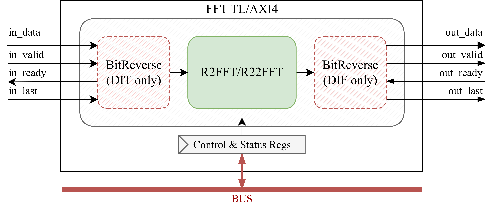

FFT Overview
============

The memory-mapped `FFTAXI4` and `FFTTL` blocks are part of the OPERA-DSP project and implement a streaming Fast Fourier Transform (FFT) for FMCW radar DSP chains.
They are built around Single-path Delay-Feedback (SDF) FFT cores and use AXI4-Stream input/output with AXI4 or TileLink memory-mapped control and status registers.

This module extends the `DspBlock <https://chipyard.readthedocs.io/en/latest/Customization/Dsptools-Blocks.html>`_ trait for modular signal processing integration. 

Key features of the FFT block include:

- Radix-2 and radix-2\ :sup:`2` SDF implementations
- Shared :doc:`SDFStage <../Modules/SDFStages>` hardware used by both radix cores
- Decimation-in-time (DIT) and decimation-in-frequency (DIF) modes
- Optional runtime FFT size control
- Optional runtime FFT direction and per-stage divide-by-two controls
- Optional per-stage overflow status
- Optional bit-reversal for natural-order streaming data
- Optional SRAM-backed delay lines for large FFT sizes 
- Configurable FixedPoint data types and scaling modes
- Optional ``dspMul4`` four-real-multiplier complex multiplication
- Configurable pipeline registers for timing optimization

For more information about the internal blocks see:

- :doc:`FFT blocks <../Modules/FFT>`
- :doc:`SDF stages <../Modules/SDFStages>`
- :doc:`BitReverse <../Modules/BitReverse>`

Simplified Block Diagram
------------------------

Below is a simplified block diagram of the FFT module.

FFT Parameters
--------------

The FFT blocks are configured using the ``FFTParams`` case class. The FFT stream uses ``inDataType`` on the input and a derived output type based on the configured stage growth.
The code block below shows the source radix selectors, ``FFTParams`` definition, and Scala defaults. The AXI4/TL apps and example JSON file use the legal 1024-point ``Radix22`` configuration shown in :ref:`fft-json-configuration`.

.. code-block:: scala

  sealed trait DecimationType
  case object DIT extends DecimationType
  case object DIF extends DecimationType

  sealed trait SDFRadix {
    def label: String
  }
  case object Radix2 extends SDFRadix {
    override val label = "2"
  }
  case object Radix22 extends SDFRadix {
    override val label = "2^2"
  }

  case class FFTParams(
    fftSize         : Int = 1024,
    twiddleType     : DspComplex[FixedPoint] = DspComplex(FixedPoint(16.W, 14.BP)),
    inDataType      : DspComplex[FixedPoint] = DspComplex(FixedPoint(16.W, 14.BP)),
    decimation      : DecimationType = DIF,
    sdfRadix        : SDFRadix = Radix22,
    growEnable      : Seq[Boolean] = Seq.empty,
    runTime         : Boolean = false,
    divBy2          : Seq[Boolean] = Seq.empty,
    divBy2Reg       : Boolean = false,
    overflowReg     : Boolean = false,
    trimType        : TrimType = RoundHalfUp,
    numAddPipes     : Int = 0,
    numMulPipes     : Int = 0,
    direction       : Boolean = true,
    directionReg    : Boolean = false,
    dspMul4         : Boolean = false,
    useBitReverse   : Boolean = false,
    minSRAMdepth    : Int = 0,
    singlePortSRAM  : Boolean = false,
    stageTrimTypes  : Seq[TrimType] = Seq.empty,
    twiddleTrimTypes: Seq[TrimType] = Seq.empty
  )

**Parameter descriptions:**

- ``fftSize``  
  Number of FFT points. This value must be a power of two.

- ``twiddleType``  
  Complex FixedPoint type used for twiddle coefficients.

- ``inDataType``  
  Complex FixedPoint type used on the input stream.

- ``decimation``  
  Selects ``DIF`` or ``DIT`` SDF scheduling.

- ``sdfRadix``  
  Selects the SDF implementation. ``Radix2`` instantiates :doc:`R2FFT <../Modules/FFT>` and ``Radix22`` instantiates :doc:`R22FFT <../Modules/FFT>`.

- ``growEnable``  
  Per-stage growth controls. Each enabled stage grows the FixedPoint width by one bit. If empty, no stages grow.

- ``runTime``  
  If ``true``, enables runtime FFT size selection through ``i_size`` or the ``size_log2`` register.

- ``divBy2``  
  Per-stage static divide-by-two controls. If empty, every stage divides by two.

- ``divBy2Reg``  
  If ``true``, enables runtime per-stage divide-by-two controls through ``i_divBy2`` or the ``divby2`` register.

- ``overflowReg``  
  If ``true``, exposes per-stage overflow status.

- ``trimType``  
  Default trim mode used for SDF butterfly scaling and twiddle multiplication when per-stage trim arrays are not supplied.

- ``numAddPipes``  
  Number of pipeline registers inserted after add/subtract operations.

- ``numMulPipes``  
  Number of pipeline registers inserted after multiplication operations.

- ``direction``  
  Static transform direction. ``true`` selects FFT ordering and ``false`` selects IFFT ordering.

- ``directionReg``  
  If ``true``, enables runtime direction selection through ``i_fft_or_ifft`` or the ``direction`` register.

- ``dspMul4``  
  If ``true``, uses the four-real-multiplier complex multiplication implementation.

- ``useBitReverse``  
  If ``true``, inserts :doc:`BitReverse <../Modules/BitReverse>` so the wrapper exposes natural-order streaming data at both ends.

- ``minSRAMdepth``  
  Delay lines deeper than this threshold use SRAM-backed storage.

- ``singlePortSRAM``  
  If ``true``, eligible delay lines and bit-reversal buffers use single-port SRAM.

- ``stageTrimTypes``  
  Optional per-stage trim modes for SDF butterfly scaling.

- ``twiddleTrimTypes``  
  Optional per-stage trim modes for twiddle multipliers.

**Requirements:**

- ``fftSize`` must be a power of two.
- ``R22FFT`` supports only ``fftSize >= 4`` and FFT sizes of the form :math:`4^N`.
- ``inDataType`` and ``twiddleType`` must be FixedPoint types with known widths.
- ``growEnable``, ``divBy2``, ``stageTrimTypes``, and ``twiddleTrimTypes`` must contain one entry per FFT stage when supplied. The number of stages is ``log2Up(fftSize)``.
- ``numAddPipes``, ``numMulPipes``, and ``minSRAMdepth`` must be non-negative.
- When ``divBy2Reg`` or ``overflowReg`` is enabled, the stage-vector register width ``log2Up(fftSize)`` must fit in ``beatBytes * 8`` bits.
- In ``R22FFT`` runtime mode, shared twiddle multiplier stage pairs must use matching ``twiddleTrimTypes``.
- In ``R22FFT`` runtime mode, loaded ``size_log2`` values must select active FFT sizes of the form :math:`4^N`.

.. _fft-json-configuration:

JSON Configuration
------------------

The AXI4 and TileLink apps accept one optional JSON file argument. If no JSON file is passed, the apps use the same default configuration as ``fft/src/main/resources/parameters.json``.

The JSON file contains one memory-mapped address region and one ``parameters`` object:

.. code-block:: json

  {
    "address": {
      "base": "0x00000500",
      "mask": "0x000000FF"
    },
    "parameters": {
      "beatBytes"       : 4,
      "fftSize"         : 1024,
      "inputWidth"      : 16,
      "inputBinPoint"   : 14,
      "twiddleWidth"    : 16,
      "twiddleBinPoint" : 14,
      "decimation"      : "DIF",
      "sdfRadix"        : "Radix22",
      "growEnable"      : [],
      "runTime"         : true,
      "divBy2"          : [],
      "divBy2Reg"       : true,
      "overflowReg"     : true,
      "trimType"        : "RoundHalfUp",
      "numAddPipes"     : 1,
      "numMulPipes"     : 1,
      "direction"       : true,
      "directionReg"    : true,
      "dspMul4"         : false,
      "useBitReverse"   : true,
      "minSRAMdepth"    : 8,
      "singlePortSRAM"  : false,
      "stageTrimTypes"  : [],
      "twiddleTrimTypes": []
    }
  }

- ``address.base`` and ``address.mask`` define the AXI4 or TileLink register region.
- ``beatBytes`` defines the memory-mapped register beat width.
- ``inputWidth``/``inputBinPoint`` and ``twiddleWidth``/``twiddleBinPoint`` define the FixedPoint input and twiddle formats.
- ``decimation`` accepts ``DIF`` or ``DIT``.
- ``sdfRadix`` accepts ``Radix2`` or ``Radix22``.
- ``growEnable``, ``divBy2``, ``stageTrimTypes``, and ``twiddleTrimTypes`` may be empty or contain one entry per FFT stage.
- Trim strings accept ``Floor``, ``Ceiling``, ``Convergent``, ``Round``, ``RoundDown``, ``RoundUp``, ``RoundTowardsZero``, ``RoundTowardsInfinity``, ``RoundHalfDown``, ``RoundHalfUp``, ``RoundHalfTowardsZero``, ``RoundHalfTowardsInfinity``, ``RoundHalfToEven``, or ``RoundHalfToOdd``.

Unknown ``decimation``, ``sdfRadix``, or trim strings fail configuration parsing instead of selecting a fallback value.

Register Map
------------

The following registers are exposed through the MMIO interface when the corresponding FFT parameter enables them:

+---------------+-------------+--------+----------------------------+------------------------+----------------------------------------------------------+
| Register Name | Offset      | Access | Width                      | Availability           | Description                                              |
+===============+=============+========+============================+========================+==========================================================+
| size_log2     | 0*beatBytes | R/W    | log2Ceil(params.fftSize)   | ``runTime``            | Active FFT size as log2(number of samples)               |
+---------------+-------------+--------+----------------------------+------------------------+----------------------------------------------------------+
| divby2        | 1*beatBytes | R/W    | log2Ceil(params.fftSize)   | ``divBy2Reg``          | Per-stage divide-by-two controls                         |
+---------------+-------------+--------+----------------------------+------------------------+----------------------------------------------------------+
| direction     | 2*beatBytes | R/W    | 1 bit                      | ``directionReg``       | Transform direction: 1 selects FFT, 0 selects IFFT       |
+---------------+-------------+--------+----------------------------+------------------------+----------------------------------------------------------+
| load_cfg      | 3*beatBytes | W      | 1 bit                      | Any runtime control    | Write 1 to pulse FFT runtime configuration load          |
+---------------+-------------+--------+----------------------------+------------------------+----------------------------------------------------------+
| overflow      | 4*beatBytes | W1C    | log2Ceil(params.fftSize)   | ``overflowReg``        | Sticky per-stage overflow status; write 1 to clear bits  |
+---------------+-------------+--------+----------------------------+------------------------+----------------------------------------------------------+

- ``size_log2``: Selects the active runtime FFT size as ``log2(number of samples)``. For example, a value of 8 selects a 256-point FFT.
- ``size_log2`` resets to ``log2Up(params.fftSize)``, selecting the maximum configured FFT size.
- ``divby2``: Controls divide-by-two scaling for each FFT stage when runtime scaling is enabled.
- ``divby2`` resets to the resolved ``divBy2`` parameter vector; an empty ``divBy2`` parameter resolves to all stages enabled.
- ``direction``: Controls FFT/IFFT direction when runtime direction is enabled.
- ``direction`` resets to ``params.direction``.
- ``load_cfg``: Latches runtime configuration values. This register is generated when ``runTime``, ``divBy2Reg``, or ``directionReg`` is enabled.
- ``load_cfg`` is write-only and resets low.
- ``overflow``: Sticky per-stage overflow status. Each bit is cleared by writing 1 to that bit.
- ``overflow`` resets to zero.

If none of ``runTime``, ``divBy2Reg``, ``directionReg``, or ``overflowReg`` is enabled, no FFT control/status register fields are generated. The AXI4 or TileLink wrapper can still be emitted, but its MMIO port has no usable FFT registers.

IOs
---

The AXI4 and TileLink FFT wrappers provide I/Os through the `DspBlock <https://chipyard.readthedocs.io/en/latest/Customization/Dsptools-Blocks.html>`_ interface:

- AXI4-Stream input and output for complex sample data.
- AXI4 or TileLink memory-mapped I/O for the control and status registers listed above.

AXI4-Stream sample data uses the ``DspComplex`` UInt layout used by the hardware and tests: the real lane occupies the upper half of the complex sample word and the imaginary lane occupies the lower half.
The wrapper consumes the lower ``params.inDataType.getWidth`` bits of input ``data`` and pads output ``data`` to a whole-byte AXI4-Stream width.

The direct `FFT` wrapper and radix-core ports are described in :doc:`FFT blocks <../Modules/FFT>`.

SystemVerilog Generation
------------------------

You can generate SystemVerilog from the FFT block using either AXI4 or TL as the memory-mapped control interface.

Use the following commands in the project root folder:

.. code-block:: bash

   # AXI4 Version
   sbt "fft/runMain opera.fft.AXI4App"
   # TileLink Version
   sbt "fft/runMain opera.fft.TLApp"

This generates SystemVerilog code in the ``./rtl/FFTAXI4`` folder for the AXI4 variant or ``./rtl/FFTTL`` for the TileLink variant.

Additionally, you can pass the path to a JSON file containing FFT parameters, for example:

.. code-block:: bash

   # AXI4 Version
   sbt "fft/runMain opera.fft.AXI4App fft/src/main/resources/parameters.json"
   # TileLink Version
   sbt "fft/runMain opera.fft.TLApp fft/src/main/resources/parameters.json"

You can find the example JSON configuration file `on GitHub <https://github.com/opera-platform/opera-dsp/blob/main/fft/src/main/resources/parameters.json>`_.

Tests
-----

To run memory-mapped FFT wrapper tests, use the following commands in the project root folder:

.. code-block:: bash

   # AXI4 Version
   sbt "fft/testOnly opera.fft.MemoryMappedAXI4FFTSpec"
   # TileLink Version
   sbt "fft/testOnly opera.fft.MemoryMappedTLFFTSpec"

The memory-mapped tests cover static stream output, runtime CSR control, and sticky overflow CSR status.
The test matrix includes ``Radix2`` and ``Radix22``, ``DIF`` and ``DIT``, static sizes ``64``, ``256``, and ``1024``, runtime maximum size ``1024``, and overflow sizes ``64`` and ``256``.
``MemoryMappedAXI4FFTSpec`` runs with ``beatBytes = 8`` and ``MemoryMappedTLFFTSpec`` runs with ``beatBytes = 4``.
The runtime CSR checks load active sizes ``1024``, ``256``, ``64``, ``16``, and ``4``; verify ``size_log2``, ``divby2``, and ``direction`` readback; compare the resulting stream output against the model; and check sticky ``overflow`` set and write-one-to-clear behavior.

The FFT test suite also includes bit-reversal frame-order tests, SDF stage model checks, direct FFT-versus-model checks, FFT-versus-floating-point checks, random ready/valid stress, output-stall backpressure checks, SQNR checks, and stage-growth coverage.

The following ScalaTest parameters can be passed after ``--``:

- ``-Dfft.verbose=true``:
  Prints detailed test log messages and CSR readback data.

- ``-Dfft.plot=true``:
  Writes FFT output plots into the test output directory.

- ``-Dfft.nonParallel=N``:
  Uses non-parallel Verilator output for FFT sizes greater than or equal to ``N``.

- ``-Dfft.randomReadyValid=true``:
  Enables randomized input ``valid`` and output ``ready`` in supported FFT stream tests.

You can also pass ScalaTest ``-z`` filters to run only tests whose generated name contains a selected field.
Useful filter values include ``static``, ``runtime``, ``overflow``, ``Radix2``, ``Radix22``, ``DIF``, ``DIT``, ``size = 64``, ``size = 256``, ``size = 1024``, and ``maxSize = 1024``.

Examples:

.. code-block:: bash

   sbt "fft/testOnly opera.fft.MemoryMappedAXI4FFTSpec -- -Dfft.verbose=true"
   sbt "fft/testOnly opera.fft.MemoryMappedTLFFTSpec -- -Dfft.plot=true -z runtime"
   sbt "fft/testOnly opera.fft.MemoryMappedAXI4FFTSpec -- -z Radix22"
   sbt "fft/testOnly opera.fft.FFTvsFloatingPointSpec -- -Dfft.randomReadyValid=true -Dfft.nonParallel=64 -z \"size = 64\""

Output directory is ``fft/test_run_dir/`` when tests are run from the project root.

Source Code
-----------

You can view the source code here: `fft/src on GitHub <https://github.com/opera-platform/opera-dsp/blob/main/fft/src>`_
