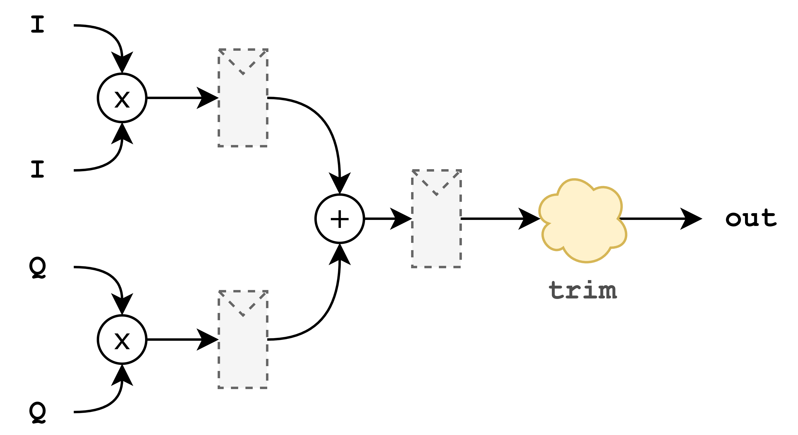
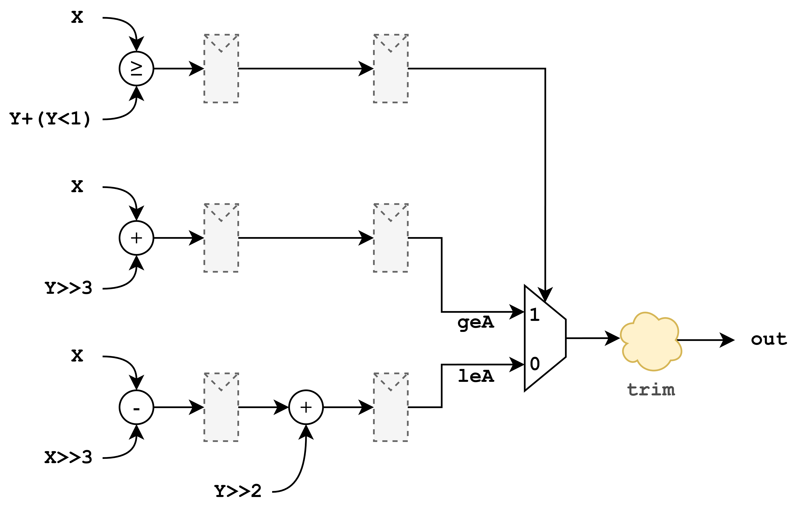
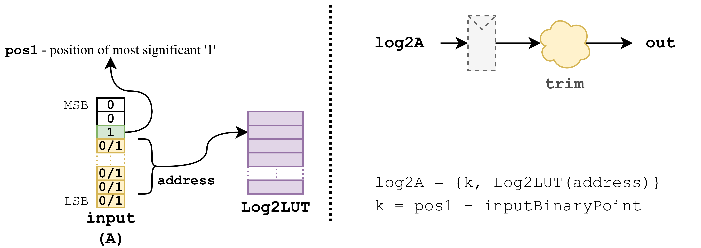
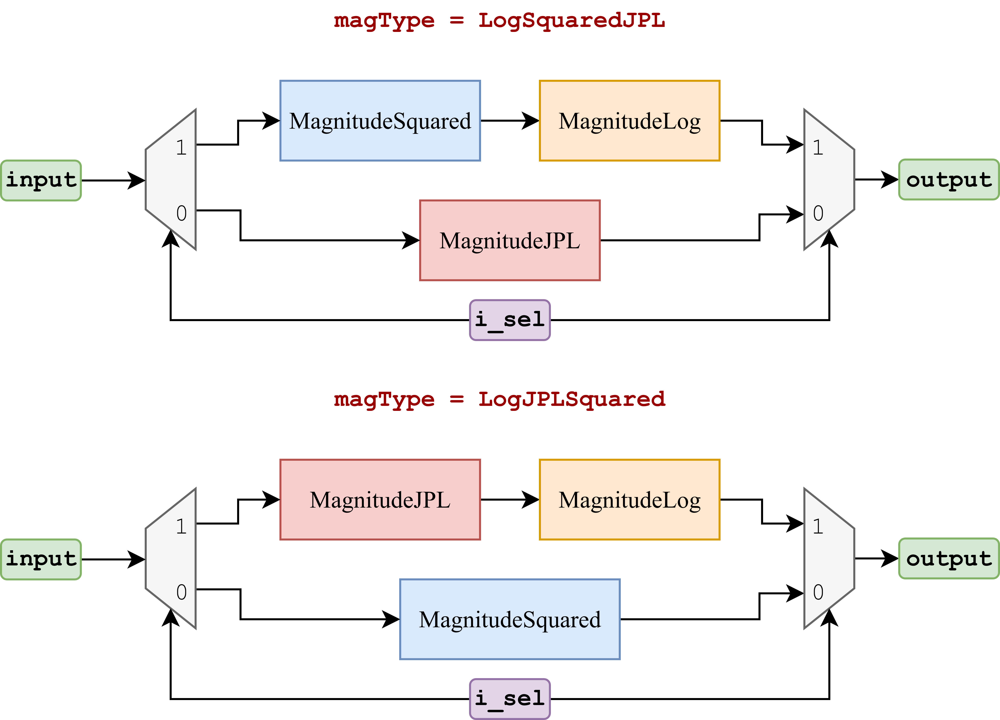

MagnitudeSquared Module
=======================

This module is used to calculate squared magnitude of complex signal.

MagnitudeSquared Parameters
---------------------------

This block uses the same set of parameters as `Magnitude` block.

**Definition:**

.. code-block:: scala

  case class LogMagnitudeParams[T <: Data](
    inputType     : DspComplex[T],
    realType      : Option[T] = None,
    outputType    : T,
    magType       : MagType = JPL,
    lutTableSize  : Option[Int] = None,
    lutTableWidth : Option[Int] = None,
    addPipeRegs   : Boolean = false,
    mulPipeRegs   : Boolean = false,
    trimType      : TrimType
  )

**Parameter descriptions:**

- ``inputType``:
  Input DspComplex[T] data type.

- ``realType``:  
  Doesn't affect this module.

- ``outputType``:
  Output data type.

- ``magType``:  
  Doesn't affect this module.

- ``lutTableSize``:  
  Doesn't affect this module.

- ``lutTableWidth``:  
  Doesn't affect this module.

- ``addPipeRegs``:  
  If `true`, inserts pipeline registers after addition stages.

- ``mulPipeRegs``:  
  If `true`, inserts pipeline registers after multiplication stages.

- ``trimType``:  
  Specifies the trimming strategy applied after arithmetic operations.

**Requirements**

It is required that the output has sufficient integer width to guarantee correct results:

- :math:`\text{output\_int\_width} \geq 2 \times \text{input\_int\_width} + 1`

where:

- :math:`\text{output\_int\_width} = \text{outputWidth} - \text{outputBinPoint}`
- :math:`\text{input\_int\_width} = \text{inputWidth} - \text{inputBinPoint}`

IOs
---

`MagnitudeSquared` has the following I/O signals:

.. code-block:: scala

  class LogMagnitudeIO[T <: Data: Real](val params: LogMagnitudeParams[T]) extends Bundle {
    val in : DecoupledIO[DspComplex[T]] = Flipped(Decoupled(params.inputType))
    val out: DecoupledIO[T] = Decoupled(params.outputType)
    val i_last: Bool = Input(Bool())
    val o_last: Bool = Output(Bool())
    val i_sel: Option[Bool] = if (params.magType == LogSquaredJPL || params.magType == LogJPLSquared) Some(Input(Bool())) else None
  }

- ``i_sel`` is not used in this module.

Module Operation
----------------

This block calculates :math:`A = I^2 + Q^2` where ``I`` is the real part of the input data and ``Q`` is the imaginary part.

Simplified block diagram is given bellow:

By enabling `addPipeRegs` and `mulPipeRegs` you can enable optional pipe registers in the image above. Output is trimmed if necessary. 

SystemVerilog Generation
------------------------

You can generate SystemVerilog for the `MagnitudeSquared` block.

Use the following commands in the project root folder:

.. code-block:: bash

   sbt "project log-magnitude; runMain opera.logmagnitude.MagnitudeSquaredApp"

This will generate SystemVerilog files in the ``./rtl/MagnitudeSquared`` directory.

If you want to modify the MagnitudeSquared configuration, edit the ``params`` definition in the `MagnitudeSquaredApp` object.

Tests
-----

To run tests, use the following command in the project root folder:

.. code-block:: bash

   sbt "project log-magnitude; testOnly opera.logmagnitude.MagnitudeSquaredSpec"

Output directory is ``./log-magnitude/test_run_dir/``.

Source Code
-----------

You can view the source code here:

`MagnitudeSquared.scala on GitHub <https://github.com/opera-platform/opera-dsp/blob/main/log-magnitude/src/main/scala/MagnitudeSquared.scala>`_

MagnitudeJPL Module
===================

This module is used to calculate Jet Propulsion Laboratory magnitude approximation. For more information refer to this `document. <https://github.com/opera-platform/opera-dsp/blob/main/log-magnitude/src/main/scala/MagnitudeSquared.scala>`_

MagnitudeJPL Parameters
------------------------

This block uses the same set of parameters as `Magnitude` block.

**Definition:**

.. code-block:: scala

  case class LogMagnitudeParams[T <: Data](
    inputType     : DspComplex[T],
    realType      : Option[T] = None,
    outputType    : T,
    magType       : MagType = JPL,
    lutTableSize  : Option[Int] = None,
    lutTableWidth : Option[Int] = None,
    addPipeRegs   : Boolean = false,
    mulPipeRegs   : Boolean = false,
    trimType      : TrimType
  )

**Parameter descriptions:**

- ``inputType``:
  Input DspComplex[T] data type.

- ``realType``:  
  Doesn't affect this module.

- ``outputType``:
  Output data type.

- ``magType``:  
  Doesn't affect this module.

- ``lutTableSize``:  
  Doesn't affect this module.

- ``lutTableWidth``:  
  Doesn't affect this module.

- ``addPipeRegs``:  
  If `true`, inserts pipeline registers after addition stages.

- ``mulPipeRegs``:  
  Doesn't affect this module. There is no multiplication.

- ``trimType``:  
  Specifies the trimming strategy applied after arithmetic operations.

**Requirements**

Ensure the output has sufficient integer width to guarantee correct results:

- :math:`\text{output\_int\_width} \geq \text{input\_int\_width} + 2`

where:

- :math:`\text{output\_int\_width} = \text{outputWidth} - \text{outputBinPoint}`
- :math:`\text{input\_int\_width} = \text{inputWidth} - \text{inputBinPoint}`

IOs
---

`MagnitudeJPL` has the following I/O signals:

.. code-block:: scala

  class LogMagnitudeIO[T <: Data: Real](val params: LogMagnitudeParams[T]) extends Bundle {
    val in : DecoupledIO[DspComplex[T]] = Flipped(Decoupled(params.inputType))
    val out: DecoupledIO[T] = Decoupled(params.outputType)
    val i_last: Bool = Input(Bool())
    val o_last: Bool = Output(Bool())
    val i_sel: Option[Bool] = if (params.magType == LogSquaredJPL || params.magType == LogJPLSquared) Some(Input(Bool())) else None
  }

- ``i_sel`` is not used in this module.

Module Operation
----------------

This block calculates :math:`A = X + Y/8` when :math:`X \geq 3Y`, or :math:`A = \frac{7}{8} X + \frac{1}{2} Y` when :math:`X < 3Y`. Here, :math:`X = \max(|I|, |Q|)` and :math:`Y = \min(|I|, |Q|)`, where ``I`` is the real part of the input data and ``Q`` is the imaginary part.

Simplified block diagram is given bellow:

By enabling `addPipeRegs` you can enable optional pipe registers in the image above. Output is trimmed if necessary. 

SystemVerilog Generation
------------------------

You can generate SystemVerilog for the `MagnitudeJPL` block.

Use the following commands in the project root folder:

.. code-block:: bash

   sbt "project log-magnitude; runMain opera.logmagnitude.MagnitudeJPLApp"

This will generate SystemVerilog files in the ``./rtl/MagnitudeJPL`` directory.

If you want to modify the MagnitudeJPL configuration, edit the ``params`` definition in the `MagnitudeJPLApp` object.

Tests
-----

To run tests, use the following command in the project root folder:

.. code-block:: bash

   sbt "project log-magnitude; testOnly opera.logmagnitude.MagnitudeJPLSpec"

Output directory is ``./log-magnitude/test_run_dir/``.

Source Code
-----------

You can view the source code here:

`MagnitudeJPL.scala on GitHub <https://github.com/opera-platform/opera-dsp/blob/main/log-magnitude/src/main/scala/MagnitudeJPL.scala>`_

MagnitudeLog Module
===================

This module is used to calculate Log2 value of the real signal. Fractional part of Log2 is stored in Look Up Table while the whole part is calculated.

MagnitudeLog Parameters
------------------------

This block uses the same set of parameters as `Magnitude` block.

**Definition:**

.. code-block:: scala

  case class LogMagnitudeParams[T <: Data](
    inputType     : DspComplex[T],
    realType      : Option[T] = None,
    outputType    : T,
    magType       : MagType = JPL,
    lutTableSize  : Option[Int] = None,
    lutTableWidth : Option[Int] = None,
    addPipeRegs   : Boolean = false,
    mulPipeRegs   : Boolean = false,
    trimType      : TrimType
  )

**Parameter descriptions:**

- ``inputType``:
  Doesn't affect this module.

- ``realType``:  
  Input data type

- ``outputType``:
  Output data type.

- ``magType``:  
  Doesn't affect this module.

- ``lutTableSize``:  
  Size of the LUT, where the actual table size is :math:`2^{\text{lutTableSize}}`.

- ``lutTableWidth``:  
  Look-Up Table (LUT) data width.

- ``addPipeRegs``:  
  If `true`, inserts pipeline registers after addition stages.

- ``mulPipeRegs``:  
  Doesn't affect this module. There is no multiplication.

- ``trimType``:  
  Specifies the trimming strategy applied after arithmetic operations.

**Requirements**

Two conditions must be satisfied to ensure correct functionality:

1. The width of the Look-Up Table (LUT) must be greater or equal to lutTableSize:

   :math:`\text{lutTableWidth} \geq \text{lutTableSize}`

   This ensures the LUT is generated correctly based on the specified table size.

2. The integer width of the output must be sufficient to represent the smallest possible value correctly:

   :math:`\text{output\_int\_width} > \log_2(\text{inputBinPoint})`

   where:

   - :math:`\text{output\_int\_width} = \text{params.outputType.getWidth} - \text{outputBinPointPosition}`
   - :math:`\text{inputBinPoint} = \text{inputBinPointPosition}`

   This guarantees correct representation of the minimum expected output value.

IOs
---

`MagnitudeLog` has the following I/O signals:

.. code-block:: scala

  class LogIO[T <: Data: Real](val params: LogMagnitudeParams[T]) extends Bundle {
    val in : DecoupledIO[T] = Flipped(Decoupled(params.realType.get))
    val out: DecoupledIO[T] = Decoupled(params.outputType)
    val i_last: Bool = Input(Bool())
    val o_last: Bool = Output(Bool())
  }

Module Operation
----------------

This block calculates the :math:`\log_2` value of the input signal. It uses a Look-Up Table (LUT) to store precomputed :math:`\log_2` values for inputs in the range :math:`[1, 2)`, while the integer (whole) part of the result is computed dynamically.

Simplified diagram is given bellow:

By enabling `addPipeRegs` you can enable optional pipe registers in the image above. Output is trimmed if necessary. 

SystemVerilog Generation
------------------------

You can generate SystemVerilog for the `MagnitudeLog` block.

Use the following commands in the project root folder:

.. code-block:: bash

   sbt "project log-magnitude; runMain opera.logmagnitude.MagnitudeLogApp"

This will generate SystemVerilog files in the ``./rtl/MagnitudeLog`` directory.

If you want to modify the MagnitudeLog configuration, edit the ``params`` definition in the `MagnitudeLogApp` object.

Tests
-----

To run tests, use the following command in the project root folder:

.. code-block:: bash

   sbt "project log-magnitude; testOnly opera.logmagnitude.MagnitudeLogSpec"

Output directory is ``./log-magnitude/test_run_dir/``.

Source Code
-----------

You can view the source code here:

`MagnitudeLog.scala on GitHub <https://github.com/opera-platform/opera-dsp/blob/main/log-magnitude/src/main/scala/MagnitudeLog.scala>`_

MagnitudeMuxed Module
=====================

This module combines previous modules.

MagnitudeLog Parameters
------------------------

This block uses the same set of parameters as `Magnitude` block.

**Definition:**

.. code-block:: scala

  case class LogMagnitudeParams[T <: Data](
    inputType     : DspComplex[T],
    realType      : Option[T] = None,
    outputType    : T,
    magType       : MagType = JPL,
    lutTableSize  : Option[Int] = None,
    lutTableWidth : Option[Int] = None,
    addPipeRegs   : Boolean = false,
    mulPipeRegs   : Boolean = false,
    trimType      : TrimType
  )

**Parameter descriptions:**

- ``inputType``:
  Input DspComplex[T] data type

- ``realType``:  
  Input data type for `MagnitudeLog`` module and output for `MagnitudeSquared` if ``magType = LogSquaredJPL`` or output for `MagnitudeJPL` if ``magType = LogJPLSquared``.

- ``outputType``:
  Output data type.

- ``magType``:  
  Can be either ``LogSquaredJPL`` or ``LogJPLSquared``.

- ``lutTableSize``:  
  Size of the LUT, where the actual table size is :math:`2^{\text{lutTableSize}}`.

- ``lutTableWidth``:  
  Look-Up Table (LUT) data width.

- ``addPipeRegs``:  
  If `true`, inserts pipeline registers after addition stages.

- ``mulPipeRegs``:  
  If `true`, inserts pipeline registers after multiplication stages.

- ``trimType``:  
  Specifies the trimming strategy applied after arithmetic operations.

IOs
---

`MagnitudeLog` has the following I/O signals:

.. code-block:: scala

  class LogMagnitudeIO[T <: Data: Real](val params: LogMagnitudeParams[T]) extends Bundle {
    val in : DecoupledIO[DspComplex[T]] = Flipped(Decoupled(params.inputType))
    val out: DecoupledIO[T] = Decoupled(params.outputType)
    val i_last: Bool = Input(Bool())
    val o_last: Bool = Output(Bool())
    val i_sel: Option[Bool] = if (params.magType == LogSquaredJPL || params.magType == LogJPLSquared) Some(Input(Bool())) else None
  }

Module Operation
----------------

This block uses input ``i_sel`` to select between upper and lower Magnitude chains. Please see the image bellow.

SystemVerilog Generation
------------------------

You can generate SystemVerilog for the `MagnitudeMuxed` block.

Use the following commands in the project root folder:

.. code-block:: bash

   sbt "project log-magnitude; runMain opera.logmagnitude.MagnitudeMuxedApp"

This will generate SystemVerilog files in the ``./rtl/MagnitudeMuxed`` directory.

If you want to modify the MagnitudeMuxed configuration, edit the ``params`` definition in the `MagnitudeMuxedApp` object.

Tests
-----

To run tests, use the following command in the project root folder:

.. code-block:: bash

   sbt "project log-magnitude; testOnly opera.logmagnitude.MagnitudeMuxedSpec"

Output directory is ``./log-magnitude/test_run_dir/``.

Source Code
-----------

You can view the source code here:

`MagnitudeMuxed.scala on GitHub <https://github.com/opera-platform/opera-dsp/blob/main/log-magnitude/src/main/scala/MagnitudeMuxed.scala>`_

