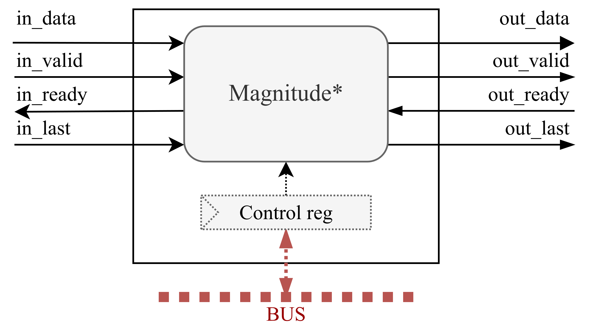

Magnitude Overview
==================

The `Magnitude` module is part of the OPERA-DSP project. This module is used to calculate (or to approximate) magnitude of a complex signal. Module supports Squared magnitude and Jet Propulsion Laboratory magnitude approximation. `Magnitude` also includes block for calculating log2 of real signal.

This module extends the `DspBlock <https://chipyard.readthedocs.io/en/latest/Customization/Dsptools-Blocks.html>`_ trait for modular signal processing integration. 

Key features of the PreProcessing block include:

- Squared magnitude (via the MagnitudeSquared module)
- JPL magnitude approximation (via the MagnitudeJPL module)
- Log2 calculation (via the MagnitudeLog module)
- Combined magnitude calculations (via the MagnitudeMuxed module)
- Runtime control via memory-mapped registers in case when MagnitudeMuxed is instantiated

For more information about these blocks see: :doc:`log-magnitude blocks <../Modules/Magnitudes>`.

Simplified Block Diagram
------------------------

Below is a simplified block diagram of the Magnitude module.

In the image, block `Magnitude*` can be one of modules given in :doc:`log-magnitude blocks <../Modules/Magnitudes>`. When `MagnitudeMuxed` is used, control register and bus are instantiated. In other cases, block have only AXI4Stream I/Os.

LogMagnitude Parameters
------------------------

.. code-block:: scala

  case class LogMagnitudeParams[T <: Data](
    inputType     : DspComplex[T],
    realType      : Option[T] = None,
    outputType    : T,
    magType       : MagType = JPL,
    lutTableSize  : Option[Int] = None,
    lutTableWidth : Option[Int] = None,
    addPipeRegs   : Boolean = false,
    mulPipeRegs   : Boolean = false,
    trimType      : TrimType
  )

**Parameter descriptions:**

- ``inputType``:
  Input DspComplex[T] data type (not used for MagnitudeLog).

- ``realType``:  
  Optional MagnitudeLog input data type (only relevant for MagnitudeLog implementations).

- ``outputType``:
  Output data type.

- ``magType``:  
  Selection of magnitude approximation type (default: `JPL`). User can choose between: `JPL`, `Log`, `Squared`, `LogJPLSquared`, `LogSquaredJPL`. Please see :doc:`supported magnitude types. <../Modules/Magnitudes>`

- ``lutTableSize``:  
  Size of the LUT, where the actual table size is :math:`2^{lutTableSize}` (only used for MagnitudeLog).

- ``lutTableWidth``:  
  Optional Look-Up Table (LUT) data width (only used if MagnitudeLog is generated).

- ``addPipeRegs``:  
  If `true`, inserts pipeline registers after addition stages.

- ``mulPipeRegs``:  
  If `true`, inserts pipeline registers after multiplication stages.

- ``trimType``:  
  Specifies the trimming strategy applied after arithmetic operations.

Register Map
------------

The following registers are exposed through the MMIO interface:

+---------------+-------------+--------+-------+---------------------------------+
| Register Name | Offset      | Access | Width | Description                     |
+===============+=============+========+=======+=================================+
| select        | 0*beatBytes | R/W    | 1     | Select between magnitude chains |
+---------------+-------------+--------+-------+---------------------------------+

- ``select``: Select control register is used to select between Magnitude chains when `LogJPLSquared` or `LogSquaredJPL` is used.

This register is only used when `magType = LogJPLSquared` or `magType = LogSquaredJPL`.

IOs
---

This module includes I/Os provided by the `DspBlock <https://chipyard.readthedocs.io/en/latest/Customization/Dsptools-Blocks.html>`_ trait (AXI4-Stream input/output and memory-mapped I/O). Memory mapped I/O is only used when `magType = LogJPLSquared` or `magType = LogSquaredJPL`.

SystemVerilog Generation
------------------------

You can generate SystemVerilog from the Windowing block using either AXI4 or TL as the memory-mapped control interface.

Use the following commands in the project root folder:

.. code-block:: bash

   # AXI4 Version
   sbt "project log-magnitude; runMain opera.logmagnitude.MagnitudeAXI4App"
   # TileLink Version
   sbt "project log-magnitude; runMain opera.logmagnitude.MagnitudeTLApp"

This generates SystemVerilog code in the ``./rtl/MagnitudeAXI4`` folder for the AXI4 variant or ``./rtl/MagnitudeTL`` for the TileLink variant.

Additionally, you can pass the path to a JSON file containing Windowing parameters, for example:

.. code-block:: bash

   # AXI4 Version
   sbt "project log-magnitude; runMain opera.logmagnitude.MagnitudeAXI4App log-magnitude/src/main/resources/parameters.json"
   # TileLink Version
   sbt "project log-magnitude; runMain opera.logmagnitude.MagnitudeTLApp log-magnitude/src/main/resources/parameters.json"

You can find the example JSON configuration file `on GitHub <https://github.com/opera-platform/opera-dsp/blob/main/log-magnitude/src/main/resources/parameters.json>`_.

Tests
-----

To run tests, use the following command in the project root folder:

.. code-block:: bash

   # AXI4 Version
   sbt "project log-magnitude; testOnly opera.logmagnitude.MagnitudeAXI4Spec"
   # TileLink Version
   sbt "project log-magnitude; testOnly opera.logmagnitude.MagnitudeTLSpec"

Output directory is ``.log-magnitude/test_run_dir/``.

Source Code
-----------

You can view the source code here:

`Magnitude.scala on GitHub <https://github.com/opera-platform/opera-dsp/blob/main/log-magnitude/src/main/scala/Magnitude.scala>`_
