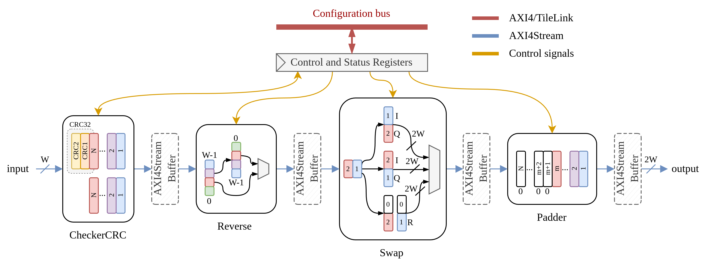

PreProcessing Overview
======================

The `PreProcessing` module is part of the OPERA-DSP project and is intended to convert raw ADC data from the radar sensor into a suitable format for subsequent DSP blocks (such as Windowing, FFT, CFAR, etc.) to process correctly.
It combines the functionality of four internal modules:

- :doc:`CheckerCRC <../Modules/CheckerCRC>`
- :doc:`Reverse <../Modules/Reverse>`
- :doc:`Swap <../Modules/Swap>`
- :doc:`Padder <../Modules/Padder>`

This module extends the `DspBlock <https://chipyard.readthedocs.io/en/latest/Customization/Dsptools-Blocks.html>`_ trait for modular signal processing integration. 

Key features of the PreProcessing block include:

- CRC checking (via the CheckerCRC module)
- Bit reversal (via the Reverse module)
- Data reordering (via the Swap module)
- Zero-padding (via the Padder module)
- Runtime control via memory-mapped registers

Simplified Block Diagram
------------------------

Data flows through the following chain of modules:

::

   [AXI4-Stream Input]
          ↓
     CheckerCRC
          ↓
       Reverse
          ↓
         Swap
          ↓
        Padder
          ↓
   [AXI4-Stream Output]

Optionally, AXI4Stream buffers may be inserted between blocks based on configuration. Below is a simplified block diagram of the PreProcessing module.



PreProcessing Parameters
------------------------

The `PreProcessing` module is configured using the ``PreProcessingParameters`` case class, which defines runtime and structural settings for chirp size, CRC behavior, and optional stream buffering.
The data width of the input AXI4Stream is restricted by the :doc:`CheckerCRC <../Modules/CheckerCRC>` module and must be either 1, 2, or 4 bytes.

.. code-block:: scala

  case class BlockParameters(
    MaxChirpSize: Int = 1024,
    MaxChirpsPerFrame: Int = 256,
    CrcParams: CRCParameters = CRCParameters(
      dataBytes = 2,
      polynomial = 0x04C11DB7,
      init = 0xFFFFFFFFL,
      reflectIn = false,
      reflectOut = false,
      xorOut = 0x00000000L
    ),
    BufferParams: BufferParameters = BufferParameters(
      insertBuffers = false,
      size = 2
    )
  )

  case class BufferParameters (
    insertBuffers: Boolean = true,
    size: Int = 2
  ) {
    assert(if(insertBuffers) size > 1 else true, f"When enabled, buffer size should be greater than 1. Set buffer size is $size")
  }

**Parameter descriptions:**

- ``MaxChirpSize``  
  The maximum number of samples per chirp. Used to size counters and padding logic.

- ``MaxChirpsPerFrame``  
  The maximum number of chirps per FMCW radar frame. Determines frame counter width and internal limits.

- ``CrcParams`` (`CRCParameters`):  
  Parameters passed to the internal :doc:`CheckerCRC <../Modules/CheckerCRC>` module. These define CRC width, polynomial, and reflection behavior.

  - ``dataBytes`` Width of input data in bytes. `CheckerCRC` supports only ``dataBytes = 1, 2 or 4``.
  - ``polynomial`` Polynomial used for CRC calculation.
  - ``init`` Initial value of the CRC register.
  - ``reflectIn`` If ``true``, each input byte is bit-reversed before processing.
  - ``reflectOut`` If ``true``, the final CRC value is bit-reversed.
  - ``xorOut`` Value XORed with the final CRC before output.

- ``BufferParams`` (`BufferParameters`):  
  Configuration for optional AXI4-Stream buffers between internal blocks.

  - ``insertBuffers``  
    If ``true``, `AXI4StreamBuffer` modules are inserted between processing blocks to decouple latency and improve timing.

  - ``size``  
    Depth of each buffer. Must be greater than 1 if buffering is enabled.

Register Map
------------

The following registers are exposed through the MMIO interface:

+------------------+----------+---------+------------------------------+------------------------------------------------+
| Register Name    | Offset   | Access  | Width                        | Description                                    |
+==================+==========+=========+==============================+================================================+
| chirpsize        | 0x00     | R/W     | log2Ceil(MaxChirpSize + 1)   | Number of samples in an FFT chirp              |
+------------------+----------+---------+------------------------------+------------------------------------------------+
| chirpexpected    | 0x04     | R/W     | log2Ceil(MaxChirpSize + 1)   | Expected input chirp samples                   |
+------------------+----------+---------+------------------------------+------------------------------------------------+
| chirpperframe    | 0x08     | R/W     | log2Ceil(ChirpsPerFrame + 1) | Number of chirps in a frame                    |
+------------------+----------+---------+------------------------------+------------------------------------------------+
| dataformat       | 0x0C     | R/W     | 2 bits                       | Current data format (used by Swap)             |
+------------------+----------+---------+------------------------------+------------------------------------------------+
| crc              | 0x10     | R       | 32 bits                      | Calculated CRC value from CheckerCRC           |
+------------------+----------+---------+------------------------------+------------------------------------------------+
| error            | 0x14     | R       | 1 bit                        | CRC mismatch flag                              |
+------------------+----------+---------+------------------------------+------------------------------------------------+
| ctrl             | 0x18     | R/W     | 4 bits                       | Bitfield control:                              |
|                  |          |         |                              |                                                |
|                  |          |         |                              | - bit 0: CRC enable (`r_en_crc`)               |
|                  |          |         |                              | - bit 1: Reverse enable (`r_en_rev`)           |
|                  |          |         |                              | - bit 2: Swap enable (`r_en_swap`)             |
|                  |          |         |                              | - bit 3: Zero padder enable (`r_en_zero`)      |
+------------------+----------+---------+------------------------------+------------------------------------------------+

- ``chirpsize``: Defines the chirp size expected by the FFT module.

- ``chirpexpected``: Specifies the number of chirp samples the PreProcessing block is expected to receive. This value must be less than or equal to ``chirpsize``. When zero padding is enabled, the :doc:`Padder <../Modules/Padder>` appends zeros to the output to account for the difference between the expected sample count (``chirpexpected``) and the configured chirp size (``chirpsize``).

- ``chirpperframe``: Specifies the expected number of chirps in a single FMCW radar frame.

- ``dataformat``: Selects one of three supported data formats for the :doc:`Swap <../Modules/Swap>` module:

  - ``0x0``: **Complex 1x** - zero-padded real input:

    - Example: If the input is 16 bits wide, the output will be 32 bits wide, with the upper half padded with zeros: ``{16'b0, input}``.

  - ``0x1``: **Complex 2x** - real and imaginary interleaving:

    - If ``r_en_swap = 1``, the output is ``{previous_input, current_input}``.  
    - If ``r_en_swap = 0``, the output is ``{current_input, previous_input}``.

  - ``0x2`` or ```0x3```: **Raw concatenation (default)**:
    
    - The output is ``{current_input, previous_input}``.

- ``crc``: Contains the CRC value computed from the input stream.

- ``error``: Indicates a mismatch between the computed CRC and the received CRC value.

- ``ctrl``: Contains control bits to enable or disable submodules within the PreProcessing block.

IOs
---

The module includes I/Os provided by the `DspBlock <https://chipyard.readthedocs.io/en/latest/Customization/Dsptools-Blocks.html>`_ trait (AXI4-Stream input/output and memory-mapped I/O), and defines the following additional signal:

.. code-block:: scala

   class PrePrecessingIO extends Bundle {
    val i_crc_data: Bool = Input(Bool())
  }

- ``i_crc_data`` is asserted when CRC data is present in the stream. It can be tied to 0. If CRC is enabled, the :doc:`CheckerCRC <../Modules/CheckerCRC>` module uses the value of the ``chirpexpected`` register to determine when to expect CRC data.

SystemVerilog Generation
------------------------

You can generate SystemVerilog from the PreProcessing block using either AXI4 or TL as the memory-mapped control interface.

Use the following commands in the project root folder:

.. code-block:: bash

   # AXI4 Version
   sbt "project preprocessing; runMain preprocessing.AXI4App"
   # TileLink Version
   sbt "project preprocessing; runMain preprocessing.TLApp"

This generates SystemVerilog code in the ``./rtl/PreProcessingAXI4`` folder for the AXI4 variant or ``./rtl/PreProcessingTL`` for the TileLink variant.

Additionally, you can pass the path to a JSON file containing PreProcessing parameters, for example:

.. code-block:: bash

   # AXI4 Version
   sbt "project preprocessing; runMain preprocessing.AXI4App preprocessing/src/main/resources/parameters.json"
   # TileLink Version
   sbt "project preprocessing; runMain preprocessing.TLApp preprocessing/src/main/resources/parameters.json"

You can find the example JSON configuration file `on GitHub <https://github.com/opera-platform/opera-dsp/blob/main/preprocessing/src/main/resources/parameters.json>`_.

Tests
-----

To run tests, use the following command in the project root folder:

.. code-block:: bash

   sbt "project preprocessing; testOnly preprocessing.PreProcessingSpec"

Output directory is ``./test_run_dir/``.

Source Code
-----------

You can view the source code here:

`PreProcessing.scala on GitHub <https://github.com/opera-platform/opera-dsp/blob/main/preprocessing/src/main/scala/PreProcessing.scala>`_
