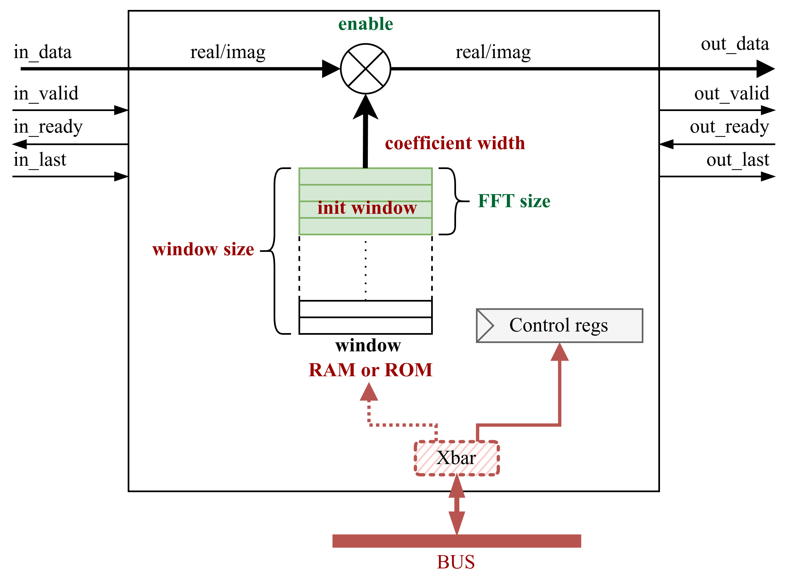

Windowing Overview
======================

The `Windowing` module is part of the OPERA-DSP project. A windowing function is typically used in digital signal processing before performing an FFT to reduce spectral leakage that appears in the frequency spectrum.

This module extends the `DspBlock <https://chipyard.readthedocs.io/en/latest/Customization/Dsptools-Blocks.html>`_ trait for modular signal processing integration. 

Supported window functions can be found here:

- :doc:`Supported window functions <../Modules/WindowFunctions>`

Simplified Block Diagram
------------------------

Below is a simplified block diagram of the Windowing module.

User can chose between ROM (Read Only Memory) to store window coefficients or RAM (Random Access Memory). If RAM is used, it is connected via Xbar to the bus.

Window Parameters
------------------------

.. code-block:: scala

  case class WindowingParams[T <: Data](
    dataType   : DspComplex[T],
    numPoints  : Int, 
    coeffType  : T,
    runTime    : Boolean,
    windowFunc : WindowType,
    memoryFile : String,
    constWindow: Boolean,
    trimType   : TrimType
  )

**Parameter descriptions:**

- ``dataType``:
  Input data type.

- ``numPoints``:  
  The maximum size of FFT window.

- ``coeffType``:
  Coefficient data type.

- ``runTime``:  
  Use run-time configurable chirp size.

- ``windowFunc``:  
  Select window function. Please see :doc:`supported functions. <../Modules/WindowFunctions>`

- ``memoryFile``:  
  Text file location in which to store coefficients. Coefficients will be stored in hex format.

- ``constWindow``:  
  Select between ROM and RAM for coefficient storage. If values is set to `true` ROM is used, else RAM si used to store coefficients. In case that RAM is used to store coefficients, coefficients can be written to the RAM via the bus (AXI4 or TileLink).

- ``trimType``:  
  Trim type (after multiplication). Supported values are: `Floor` (round-down), `Ceiling` (round-up), `Convergent` (round half to even) and `Round` (round half towards infinity).

Register Map
------------

The following registers are exposed through the MMIO interface:

+------------------+-------------+---------+--------------------------------+------------------------+
| Register Name    | Offset      | Access  | Width                          | Description            |
+==================+=============+=========+================================+========================+
| chirpsize        | 0*beatBytes | R/W     | log2Ceil(params.numPoints + 1) | FFT window size        |
+------------------+-------------+---------+--------------------------------+------------------------+
| ctrl             | 1*beatBytes | R/W     | log2Ceil(MaxChirpSize + 1)     | Enable windowing block |
+------------------+-------------+---------+--------------------------------+------------------------+

- ``chirpsize``: Defines the expected FFT window size.

- ``ctrl``: Contains control bits to enable or disable Windowing block. If disabled, input data is just passed to output.

IOs
---

The module includes I/Os provided by the `DspBlock <https://chipyard.readthedocs.io/en/latest/Customization/Dsptools-Blocks.html>`_ trait (AXI4-Stream input/output and memory-mapped I/O).

SystemVerilog Generation
------------------------

You can generate SystemVerilog from the Windowing block using either AXI4 or TL as the memory-mapped control interface.

Use the following commands in the project root folder:

.. code-block:: bash

   # AXI4 Version
   sbt "project windowing; runMain opera.windowing.AXI4App"
   # TileLink Version
   sbt "project windowing; runMain opera.windowing.TLApp"

This generates SystemVerilog code in the ``./rtl/WindowingAXI4`` folder for the AXI4 variant or ``./rtl/WindowingTL`` for the TileLink variant.

Additionally, you can pass the path to a JSON file containing Windowing parameters, for example:

.. code-block:: bash

   # AXI4 Version
   sbt "project windowing; runMain opera.windowing.AXI4App windowing/src/main/resources/parameters.json"
   # TileLink Version
   sbt "project windowing; runMain opera.windowing.TLApp windowing/src/main/resources/parameters.json"

You can find the example JSON configuration file `on GitHub <https://github.com/opera-platform/opera-dsp/blob/main/windowing/src/main/resources/parameters.json>`_.

Tests
-----

To run tests, use the following command in the project root folder:

.. code-block:: bash

   # AXI4 Version
   sbt "project windowing; testOnly opera.windowing.WindowingAXI4Spec"
   # TileLink Version
   sbt "project windowing; testOnly opera.windowing.WindowingTLSpec"

Output directory is ``.windowing/test_run_dir/``.

Source Code
-----------

You can view the source code here:

`Windowing.scala on GitHub <https://github.com/opera-platform/opera-dsp/blob/main/windowing/src/main/scala/Windowing.scala>`_
